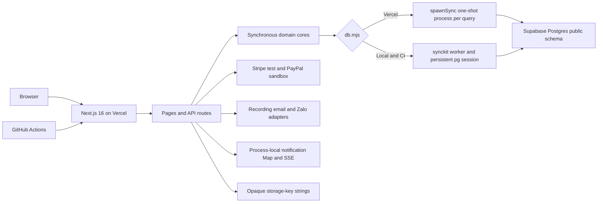
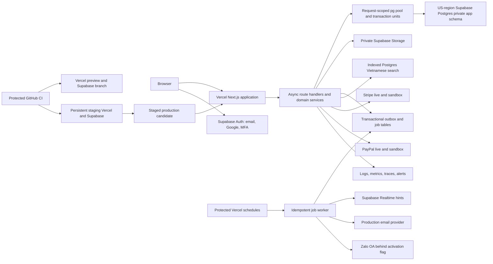
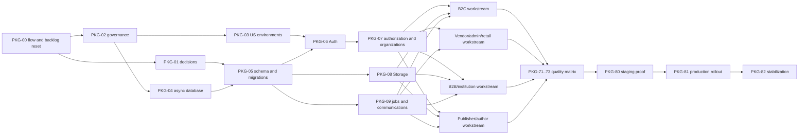

# SachViet full nine-portal production completion plan

## 1. Executive assessment

This plan is based on a read-only audit of `main` at commit `3eff19e95aaa7d0ba1e8f6b298d22fdd1187b75e` on 2026-07-28. No files, databases, accounts, providers, or infrastructure were changed. The pre-existing untracked `.env.local` and `.vercel/` paths remain untouched.

Current evidence:

- `npm run quality` passed lint, 204 Node tests, verifier scripts, TypeScript, and the 59-route Next.js build.
- Test coverage was 91.22 percent lines, 77.61 percent branches, and 90.68 percent functions. It does not cover complete TSX interactions, real HTTP behavior, or the Vercel-only database adapter.
- The production health, home, login, cart, and one-product catalog reads returned HTTP 200 during the audit.
- The current application has one partial admin UI. The other protected portals are empty or policy notices.
- Stripe test mode and PayPal sandbox have prior evidence. Live payment readiness is not proved.
- Production release is blocked even if all current tests remain green.

Confirmed P0 blockers:

1. [db.mjs](/Users/stephencheng/Projects/CyberSkill/sachviet/app/web/src/lib/db.mjs:122) selects a Vercel child-process adapter. [db-rpc-oneshot.mjs](/Users/stephencheng/Projects/CyberSkill/sachviet/app/web/src/lib/db-rpc-oneshot.mjs:87) ignores transaction boundaries and opens a new client per query. Multi-write production operations can partially commit.
2. Runtime database opening applies migrations. On Vercel those migrations are also non-atomic.
3. Checkout has no request idempotency, stock reservation, stock decrement, or exact provider reconciliation. Provider setup failure can leave abandoned pending orders.
4. Payment handling is sandbox-only and lacks a durable provider-event ledger, refunds, disputes, chargebacks, and complete amount and currency checks.
5. Email, Zalo, and optional Meilisearch resolvers lack working production submitters. Credentials alone cannot make them operational.
6. Live notification delivery uses a process-local `Map`, so events can be lost between Vercel instances.
7. [the dynamic portal page](</Users/stephencheng/Projects/CyberSkill/sachviet/app/web/src/app/(portals)/[portal]/page.tsx:9>) renders a real dashboard only for admin.
8. The current production smoke script permits skipped required checks and cannot serve as a release gate.

Status codes used below:

- `L`: limited live read observed.
- `V`: verified only in local, CI, or provider sandbox conditions.
- `P`: partial UI and backend connection.
- `A`: domain or API behavior exists without a complete user interface.
- `B`: confirmed broken in the target runtime.
- `M`: missing.
- `K`: blocked by an accepted owner, finance, legal, or provider gate.
- `O`: obsolete and scheduled for retirement.

A flow is complete only when every applicable scenario has reached `automated_pass`, `staging_pass`, and either `production_verified` or `production_verified_safe_alternative`. There must be no open P0 or P1 release blocker, unsafe migration, missing rollback path, failed cleanup, or unverified authorization boundary.

## 2. Product and architecture map

SachViet is one product serving three businesses:

- A Vietnamese-book marketplace for US consumers.
- Blind institutional brokerage for libraries, schools, and universities.
- Author and publisher submission, editorial, rights, publication, and royalty operations.

The product target contains nine portals: customer storefront, vendor, admin, employee, retail, B2B, institution, publisher, and author. Supplier is not a tenth portal.

Current architecture:

Target architecture:

Target trust rules:

- Browser code may receive only Supabase publishable configuration. It must never receive a service-role key, database password, provider secret, or migration credential.
- All application data belongs in a non-exposed `app` schema. `anon`, `authenticated`, and `PUBLIC` receive no direct application-table privileges.
- Supabase Auth owns identity. `app.user_profiles`, organization memberships, and application state own authorization.
- Authorization uses server-fetched application state. User-editable identity metadata is never an authorization source.
- Runtime and migration roles are separate. Runtime cannot change schema.
- Storage buckets are private. Upload and download access is granted per object through short-lived server-issued URLs.
- Payment, settlement, royalty, return, and audit records are append-only or reversal-based where accounting history must be preserved.
- Real-time messages are hints. Durable database state and cursor reads remain the source of truth.

Public interface changes:

- Replace custom `sv_session` handling with Supabase Auth SSR cookies and server-side identity validation.
- Standardize errors as `{ error: { code, message, fieldErrors?, requestId } }`.
- Standardize lists as `{ items, nextCursor }`; use bounded cursor pagination rather than unbounded arrays.
- Standardize money as `{ currency: "USD", amountMinor: "1234" }`, with `amountMinor` serialized as a string and stored as `BIGINT`.
- Require `Idempotency-Key` for checkout, refunds, settlement creation, quote conversion, import/export jobs, and other replay-sensitive commands.
- Require optimistic concurrency through `version` plus `If-Match`, or equivalent conditional state transitions.
- Return `409` for idempotency or state conflicts, `422` for field validation, `429` for rate limits, `401` for missing identity, and `403` for valid but unauthorized identity.
- Add typed file upload-session, completion, download, replacement, quarantine, and removal contracts.
- Add a provider event ledger keyed by provider and event ID before any webhook changes business state.
- Add release flags for registration, checkout providers, external email, Zalo, settlement, royalties, and destructive account operations.

## 3. User-role and permission matrix

| Actor | Product access | Ownership and mutation rules | Identity controls |
|---|---|---|---|
| Anonymous | Home, catalog, search, product pages, public review summaries, policies, registration and login | Read published data only | No session |
| Customer | Customer account, cart, wishlist, checkout, orders, reviews, support, vendor application | Own profile, addresses, orders, reviews, tickets, preferences, and privacy requests | Verified email; Google or password login; MFA optional |
| Vendor applicant | Customer access plus application status | Own application until a terminal decision; revision or reapplication follows accepted policy | Verified customer identity |
| Vendor organization owner | Vendor portal and customer capabilities | Organization catalog, offers, inventory, fulfillment, members, reports, and settlement views | MFA required before privileged or financial actions |
| Vendor member | Vendor functions granted by organization role | Organization-scoped records only; no owner or financial action without permission | MFA when granted privileged access |
| Publisher organization owner/member | Publisher portal and customer capabilities | Organization submissions, files, catalog, MARC, rights, contracts, reports, and accepted finance views | Invitation plus verification; MFA for contract or financial access |
| Author | Author portal and customer capabilities | Own manuscript versions, reviews, contracts, publication data, statements, and settings | Invitation or approved onboarding; MFA for contract or financial access |
| School librarian | Institution portal and customer capabilities | Organization selection lists, quotes, POs, orders, invoices, MARC, and members according to organization role | Invitation plus verification; MFA for purchasing authority |
| Employee | Shared staff portal | Assigned queues and internal operational data only | Invitation, verified company identity, mandatory MFA |
| Employee B2C | Employee and retail portals | Customer support, retail orders, fulfillment, returns, moderation, and assigned exceptions | Mandatory MFA |
| Employee B2B | Employee and B2B portals | Organizations, blind quotes, negotiations, contracts, orders, invoices, and MARC coordination | Mandatory MFA |
| Admin | Admin portal and supervised access to every product domain | May override only through named commands with reason, actor, audit event, and policy checks | Mandatory MFA, short privileged session, device revocation |
| Super admin alias | Migrated as admin | No separate bypass semantics | Backfill to admin and retire alias after compatibility window |
| Supplier reservation | None | Remove role, ACL, route matcher, label, seeds, and stale documentation | No replacement role |

Authorization must be enforced in route handlers and domain services. Hiding controls is never treated as access control. Every protected route receives anonymous, allowed-role, denied-role, owner, non-owner, same-organization, and other-organization tests where applicable.

## 4. Complete user-flow catalog

Scenario suffixes apply to every flow:

- `.H01`: happy path.
- `.V01`: validation and boundary input.
- `.U01`: anonymous, expired, or revoked identity.
- `.F01`: wrong role, owner, organization, or financial authority.
- `.R01`: retry, replay, or duplicate submission.
- `.C01`: concurrent mutation or stale version.
- `.D01`: provider, storage, database, queue, or network failure.
- `.E01`: empty, archived, deleted, unavailable, or missing state.
- `.S01`: pagination, long input, or high-volume data.
- `.A01`: keyboard, screen reader, responsive, locale, time-zone, and formatting behavior.

Each scenario receives `TC-<flow-id>.<suffix>`. Each flow receives `PV-<flow-id>` using the production modes defined in section 19.

### Shared platform flows

| ID | Actor and entry | Target steps and result | Current | Package and production mode |
|---|---|---|---|---|
| `FL-PLT-01` | Operator, `/api/health` and `/api/ready` | Liveness checks the process only. Readiness checks database, schema version, jobs, storage, required provider modes, and release SHA without exposing errors or secrets. | `P/L` | `PKG-03,09,73`; `PV0` |
| `FL-PLT-02` | All users, any route or deep link | Resolve the canonical route, restore identity, route an expired identity to login with the full return URL, return forbidden for a valid wrong role, and return semantic not-found responses. | `P/B` | `PKG-11,70`; `PV0/PV1` |
| `FL-PLT-03` | All users, shared layout | Render Vietnamese by default and English by preference, persist locale and light/dark theme before hydration, format USD and time consistently, and meet WCAG 2.2 AA at supported viewports. | `P` | `PKG-70`; `PV0/PV1` |
| `FL-PLT-04` | Signed-in user, notification center | Persist event, publish a real-time hint, fetch by cursor, update unread count, mark read, follow an authorized deep link, and recover through polling after disconnect. | `A/B` | `PKG-09,70`; `PV1` |
| `FL-PLT-05` | Signed-in user and operator, settings and delivery views | Save channel preferences, enqueue localized email, send through the approved provider, record provider status, retry transient failures, dead-letter terminal failures, and activate Zalo only after OA approval. | `A/K` | `PKG-01,09`; email `PV1`, Zalo `PV2` |
| `FL-PLT-06` | Authorized user, file controls | Request upload, validate type and size, upload privately, scan and quarantine, attach only a clean object, issue expiring downloads, replace or remove under retention rules, and audit access. | `M` | `PKG-08`; `PV1/PV4` |
| `FL-PLT-07` | Provider or scheduled worker | Record webhook or job once, claim with a lease, run idempotently, retry with backoff, recover after worker death, dead-letter, replay through an audited command, and expose queue health. | `P/B` | `PKG-09`; `PV1/PV2` |
| `FL-PLT-08` | Privileged user and auditor | Record actor, subject, organization, command, reason, before/after references, request ID, timestamp, policy version, and result in immutable history. | `M` | `PKG-07`; `PV1/PV4` |
| `FL-PLT-09` | User or operator, export surfaces | Create tenant-scoped exports asynchronously, validate contents, deliver privately, expire files, and retire WordPress import, supplier, and admin AI surfaces after dependency checks. | `A/O` | `PKG-10,70`; `PV0/PV1` |
| `FL-PLT-10` | Account holder and privacy operator | Capture consent, show data uses, accept access/correction/export/deletion requests, apply legal-retention exceptions, anonymize eligible data, and retain decision evidence. | `M/K` | `PKG-01,06,07,70`; `PV1/PV4` |
| `FL-PLT-11` | Operator, dashboards and flags | Correlate request, release, user-safe subject, database, job, payment, and provider events; manage kill switches; enforce cost limits; alert owners; and link every alert to a runbook. | `M/P` | `PKG-03,73`; `PV0/PV1` |

### Identity and account flows

| ID | Actor and entry | Target steps and result | Current | Package and production mode |
|---|---|---|---|---|
| `FL-ID-01` | Visitor, `/register` | Register with email, receive controlled verification email, verify once, handle duplicate/resend/expired links, create customer profile, and land in the customer account. | `M` | `PKG-06`; `PV1` |
| `FL-ID-02` | External partner, onboarding routes | Vendor applies from customer identity; publisher, author, and institution owners accept approved invitations; create organization and initial role only after approval. | `A/M` | `PKG-06,07,30,50,60`; `PV1` |
| `FL-ID-03` | Admin or organization owner, member settings | Invite staff or organization members, assign a scoped role, accept invitation, require MFA where privileged, change access with version checks, revoke sessions, and offboard. | `M` | `PKG-06,07`; `PV1/PV4` |
| `FL-ID-04` | User, `/login` and OAuth callback | Authenticate by verified email/password or Google, reject unsafe redirects, restore the session after refresh, map to application profile and organization roles, and route to the correct portal. | `P/V` | `PKG-06`; `PV1` |
| `FL-ID-05` | Signed-in user, security settings | Enroll MFA where required, list devices, rotate sessions after login or privilege change, revoke one or all devices, expire idle sessions, and recover cleanly on stale cookies. | `M/P` | `PKG-06,07`; `PV1` |
| `FL-ID-06` | User, recovery routes | Request reset without account enumeration, validate one-time token, change password, revoke prior sessions, notify the account, and handle expired, used, or abused requests. | `M` | `PKG-06,09`; `PV1` |
| `FL-ID-07` | Account holder, account settings | View and edit allowed profile fields, locale, time zone, contact settings, addresses, and notification preferences with reauthentication for sensitive changes. | `M/A` | `PKG-06,70`; `PV1` |
| `FL-ID-08` | User and authorized operator | Move through invited, unverified, active, inactive, suspended, reactivated, and deleted states; block access immediately; preserve required records; record reason and appeal path. | `M` | `PKG-01,06,07`; `PV1/PV4` |
| `FL-ID-09` | Account holder, privacy settings | Request export or deletion, reauthenticate, show retained classes and schedule, run the job, notify completion, revoke sessions, and prove organization/financial retention boundaries. | `M/K` | `PKG-01,06,70`; `PV1/PV4` |

### Customer marketplace flows

| ID | Actor and entry | Target steps and result | Current | Package and production mode |
|---|---|---|---|---|
| `FL-B2C-01` | Visitor, `/` | Load published home sections, promotions, featured books, personalized rows only with consent, and recover independently when one section fails. | `P` | `PKG-20,40`; `PV0` |
| `FL-B2C-02` | Visitor, catalog route | Browse category, filter, sort, paginate by cursor, retain URL state, share the URL, and distinguish empty results from errors. | `P` | `PKG-20`; `PV0` |
| `FL-B2C-03` | Visitor, search field | Normalize Vietnamese input, query indexed Postgres search, return bounded suggestions and ranked pages, redact analytics, and recover from timeout without loading all products. | `P/B` | `PKG-20,73`; `PV0` |
| `FL-B2C-04` | Visitor, `/products/[slug]` | Render semantic metadata, gallery, variants, offers, stock, descriptions, reviews, availability, and a real 404 for unpublished or missing products. | `P` | `PKG-20,08`; `PV0` |
| `FL-B2C-05` | Visitor or customer, offer selector | Compare active offers, apply the accepted buy-box rule, select a valid edition and vendor, display exact USD pricing, and explain out-of-stock or changed offers. | `P` | `PKG-20,30`; `PV0/PV1` |
| `FL-B2C-06` | Customer, cart | Add offer, quantity, plastic cover, and gift wrap; persist locally and server-side after login; merge devices deterministically; requote stale items; and enforce stock limits. | `P` | `PKG-20,21`; `PV1` |
| `FL-B2C-07` | Customer, wishlist | Add, remove, archive, restore, paginate, move to cart, and create or revoke a safe public share link that reveals no account data. | `M` | `PKG-23`; `PV1` |
| `FL-B2C-08` | Customer, checkout review | Select address and shipping method, calculate add-ons, promotions, tax, shipping, and exact total, show vendor splits, reserve stock, and require acceptance of the final quote. | `M/K` | `PKG-01,21,22`; `PV1/PV2` |
| `FL-B2C-09` | Customer, checkout command | Submit one idempotent command, create order and payment attempt atomically, reserve inventory, create Stripe or PayPal session, and return the provider redirect without duplicate orders. | `P/B/K` | `PKG-21`; staging `PV2`, live `PV3` |
| `FL-B2C-10` | Customer and provider callbacks | Return from provider without changing truth on a GET, receive verified webhook, ledger the event, reconcile provider/order/amount/currency, transition once, enqueue side effects, and repair delayed or duplicate events. | `P/B/K` | `PKG-21,09`; staging `PV2`, live `PV3` |
| `FL-B2C-11` | Customer, order list/detail | List owned orders, open item and vendor splits, view payment, shipment, invoice, communication, return, refund, and audit-safe timeline, and follow notification links. | `P/B` | `PKG-22`; `PV1/PV3` |
| `FL-B2C-12` | Customer, order actions | Retry failed payment, cancel within policy, open return or exchange, track inspection, receive partial or full refund, view dispute state, and preserve accounting reversals. | `M/K` | `PKG-01,22,31`; `PV1`, refunds `PV3`, chargebacks `PV4` |
| `FL-B2C-13` | Verified purchaser, product review | Create one verified review, edit or delete within policy, report abuse, see moderation state, and prevent spam, duplicates, or arbitrary product references. | `A/M` | `PKG-23,40`; `PV1` |
| `FL-B2C-14` | Customer, support routes | Create ticket or goods request, attach safe files, post messages, view status and assignment, reopen if allowed, receive replies, and recover from timeout or duplicate submit. | `A/M` | `PKG-23,41`; `PV1` |

### Vendor flows

| ID | Actor and entry | Target steps and result | Current | Package and production mode |
|---|---|---|---|---|
| `FL-VEN-01` | Customer/vendor applicant | Submit, inspect, revise, withdraw, receive approval or rejection, reapply under policy, and create the vendor organization atomically on approval. | `A/P/B` | `PKG-01,30,40`; `PV1` |
| `FL-VEN-02` | Vendor member, `/vendor/dashboard` | View scoped sales, order, stock, settlement, return, and service metrics with defined calculations, filters, empty states, and drill-downs. | `A/M` | `PKG-30`; `PV1` |
| `FL-VEN-03` | Authorized vendor member | Create, edit, duplicate, archive, restore, and remove owned products, variants, media, and offers through approval rules and version checks. | `A/M` | `PKG-30,08`; `PV1` |
| `FL-VEN-04` | Inventory manager | Adjust stock with reason, import bounded updates, view ledger and reservations, resolve conflicts, and see buy-box effects without editing another vendor's data. | `A/M` | `PKG-30,22`; `PV1` |
| `FL-VEN-05` | Vendor operator | List assigned order lines, open item detail, accept work under policy, and see customer-safe fulfillment data without unrelated order or payment details. | `A/M` | `PKG-22,30`; `PV1` |
| `FL-VEN-06` | Vendor operator | Pack, ship, add or correct tracking, handle carrier failure, mark delivery through accepted evidence, and recover after concurrent staff action. | `M/K` | `PKG-01,22,30`; `PV1` |
| `FL-VEN-07` | Vendor and retail staff | Respond to cancellation, return, exchange, refund, damage, lost shipment, and stock restoration cases while preserving customer privacy and accounting history. | `M/K` | `PKG-01,22,41`; `PV1/PV4` |
| `FL-VEN-08` | Vendor financial role | View eligible, held, reserved, settled, failed, reversed, and refund-offset earnings; inspect statements and transfer references; never set arbitrary amounts. | `A/K` | `PKG-01,31`; `PV1/PV4` |
| `FL-VEN-09` | Vendor analyst | Filter KPIs, compare periods, paginate lines, and export CSV safely with formula-injection protection and organization scoping. | `M` | `PKG-30,70`; `PV1` |
| `FL-VEN-10` | Vendor owner | Manage organization profile, members, roles, payout settings, notification preferences, MFA, sessions, and offboarding with reauthentication and audit. | `A/M` | `PKG-06,07,30`; `PV1/PV4` |

### Admin flows

| ID | Actor and entry | Target steps and result | Current | Package and production mode |
|---|---|---|---|---|
| `FL-ADM-01` | Admin, dashboard | View defined KPIs and recent events; each panel loads independently, reports stale/error state, filters, and links to source records. | `P` | `PKG-40`; `PV1` |
| `FL-ADM-02` | Catalog admin | Manage category, product, variant, media, offer, inventory, archive, restoration, and publication lifecycles with validation and history. | `P/M` | `PKG-20,40`; `PV1` |
| `FL-ADM-03` | Content admin | Create, order, schedule, preview, publish, rollback, archive, and report home sections, banners, and promotions without code deployment. | `A/M` | `PKG-40`; `PV1` |
| `FL-ADM-04` | Identity admin | Search users and organizations, invite, suspend, reactivate, change scoped roles, require MFA, revoke sessions, and review access history. | `M` | `PKG-06,07,40`; `PV1/PV4` |
| `FL-ADM-05` | Admin, vendor applications | Review evidence, decide once, record reason, create organization and role atomically, suspend or reinstate under policy, and resolve concurrent decisions. | `P/B` | `PKG-30,40`; `PV1` |
| `FL-ADM-06` | Commerce admin | Search B2C and B2B orders, inspect full timeline, correct allowed metadata, handle exceptions, and invoke named audited transitions rather than direct status edits. | `P/M` | `PKG-22,40,50`; `PV1` |
| `FL-ADM-07` | Returns/refunds admin | Review eligibility, approve or reject, execute provider refund, reconcile amount and tax, restore stock when applicable, handle disputes, and record reversals. | `M/K` | `PKG-01,22,40`; refund `PV3`, dispute `PV4` |
| `FL-ADM-08` | Financial approver | Approve vendor settlements and author/publisher statements with separation of duties, policy versions, adjustments, transfer status, and reconciliation. | `A/K` | `PKG-01,31,61`; `PV4` unless separately authorized |
| `FL-ADM-09` | Support/moderation admin | Assign and escalate tickets, goods requests, and returns; moderate reviews; apply takedowns; record reasons; and meet accepted response targets. | `M/A` | `PKG-23,40,41`; `PV1` |
| `FL-ADM-10` | Integration admin | View production readiness, preview email templates, inspect delivery and dead letters, replay safe jobs, rotate provider configuration, and activate Zalo separately. | `A/M` | `PKG-09,40`; email `PV1`, Zalo `PV2` |
| `FL-ADM-11` | Admin/privacy operator | Search audit history, process privacy requests, inspect health and release state, control flags, and export evidence. Retire AI and WordPress import controls. | `P/M/O` | `PKG-10,40,70`; `PV0/PV1/PV4` |

### Employee and retail flows

| ID | Actor and entry | Target steps and result | Current | Package and production mode |
|---|---|---|---|---|
| `FL-EMP-01` | Employee, `/employee/dashboard` | View role-appropriate KPIs, assignments, alerts, and drill-downs with no mocked values. | `A/M` | `PKG-41`; `PV1` |
| `FL-EMP-02` | Employee | View assigned queues, claim or reassign work, apply approved actions, escalate, and recover from conflicts. | `A/M` | `PKG-41`; `PV1` |
| `FL-EMP-03` | Authorized content employee | Edit, preview, schedule, publish, reorder, and roll back home content through versioned drafts. | `A/M` | `PKG-40,41`; `PV1` |
| `FL-EMP-04` | Employee | Manage profile, notifications, MFA, devices, scoped exports, and personal activity history. | `M` | `PKG-06,41,70`; `PV1` |
| `FL-RET-01` | B2C employee, retail dashboard | View retail demand, customer-safe lookup, queue counts, exceptions, and service metrics. | `A/M` | `PKG-41`; `PV1` |
| `FL-RET-02` | B2C employee, order queue | Search and claim orders, inspect detail, perform approved state transitions, and resolve stale or duplicate actions. | `A/M` | `PKG-22,41`; `PV1` |
| `FL-RET-03` | B2C employee, fulfillment workspace | Coordinate vendor lines, packing, shipping, tracking, delivery exception, split shipment, and inventory effects. | `M/K` | `PKG-01,22,41`; `PV1` |
| `FL-RET-04` | B2C employee, returns workspace | Open or review return case, inspect items, decide eligibility, coordinate return shipping, record inspection, hand off refund, and close. | `M/K` | `PKG-01,22,41`; `PV1/PV4` |
| `FL-RET-05` | B2C employee, service queues | Handle tickets, goods requests, review moderation, assignment, escalation, closure, and customer notification. | `A/M` | `PKG-23,41`; `PV1` |
| `FL-RET-06` | B2C employee | Filter and export scoped operations data, manage notifications, and inspect actor history without exposing payment secrets. | `M` | `PKG-41,70`; `PV1` |

### B2B staff flows

| ID | Actor and entry | Target steps and result | Current | Package and production mode |
|---|---|---|---|---|
| `FL-B2B-01` | B2B employee, pipeline | View paginated quote pipeline, filters, assignments, expiry, alerts, and working detail deep links. | `A/M` | `PKG-50`; `PV1` |
| `FL-B2B-02` | B2B employee, organization settings | Create and verify institution organization, invite scoped members, transfer ownership, suspend access, and enforce the blind-broker boundary. | `A/M/B` | `PKG-06,07,50`; `PV1` |
| `FL-B2B-03` | B2B employee, quote intake | Open institution request, validate organization and selection list, assign owner, record requirements, and reject duplicates or unauthorized access. | `A/M` | `PKG-50`; `PV1` |
| `FL-B2B-04` | B2B employee, quote editor | Create versions, price every line, apply approved discounts, send, negotiate through messages, expire, and retain immutable version history. | `A/M/K` | `PKG-01,50`; `PV1` |
| `FL-B2B-05` | Authorized B2B staff | Accept rejection, lost, or won transition once; require complete pricing and authority; convert a won quote into one order atomically. | `A/B` | `PKG-04,05,50`; `PV1` |
| `FL-B2B-06` | Staff and authorized institution member | Upload, scan, review, replace, sign, accept, and retain contract and PO files through private access and audit. | `A/M/K` | `PKG-01,08,50`; `PV1/PV4` |
| `FL-B2B-07` | B2B staff | Move order through awaiting PO, confirmed, fulfillment, partial delivery, invoiced, paid, cancelled, and exception states under accepted terms. | `A/M/K` | `PKG-01,22,50`; `PV1/PV4` |
| `FL-B2B-08` | B2B staff | Validate publisher MARC, associate entitlement with confirmed lines, issue or replace files, coordinate institution delivery, and audit downloads. | `A/M` | `PKG-08,50`; `PV1` |
| `FL-B2B-09` | B2B analyst | Export scoped pipeline, quote, order, invoice, and service reports; deliver notifications and preserve actor history. | `M` | `PKG-50,70`; `PV1` |

### Institution flows

| ID | Actor and entry | Target steps and result | Current | Package and production mode |
|---|---|---|---|---|
| `FL-INS-01` | Institution owner/member | Accept invitation, join one or more approved organizations, assign internal member roles, remove members, and enforce purchasing authority. | `A/M` | `PKG-06,07,50`; `PV1` |
| `FL-INS-02` | Librarian, institution catalog | Browse and search institutional metadata, open product and MARC availability, and never see upstream vendor or supplier data. | `A/M` | `PKG-20,50`; `PV0/PV1` |
| `FL-INS-03` | Librarian, selection lists | Create, rename, duplicate, add or edit items, archive, restore, delete, paginate, and share only within approved organization boundaries. | `A/M` | `PKG-50`; `PV1` |
| `FL-INS-04` | Authorized librarian | Convert a selection list into a quote request, validate quantities and organization authority, submit once, withdraw under policy, and receive acknowledgement. | `A/M` | `PKG-50`; `PV1` |
| `FL-INS-05` | Authorized librarian | View quote versions, ask questions, receive revisions, accept or reject within validity, and see clear expiry or supersession state. | `A/M/K` | `PKG-01,50`; `PV1` |
| `FL-INS-06` | Institution owner | View USD budget and approved authority rules, request internal approval, and see commitments, invoices, and remaining balance as defined by policy. | `A/K` | `PKG-01,50`; `PV1/PV4` |
| `FL-INS-07` | Authorized purchaser | Upload and submit PO, replace before acceptance, respond to rejection, approve contract where required, and preserve private file history. | `A/M/K` | `PKG-01,08,50`; `PV1/PV4` |
| `FL-INS-08` | Institution member | List orders, open fulfillment and invoice detail, record allowed payment evidence, request cancellation, and receive delivery updates. | `A/M/K` | `PKG-22,50`; `PV1/PV4` |
| `FL-INS-09` | Entitled librarian | List purchased MARC records, download a clean current version, reject other-organization access, audit delivery, and manage portal notifications and exports. | `A/M` | `PKG-08,50,70`; `PV1` |

### Publisher flows

| ID | Actor and entry | Target steps and result | Current | Package and production mode |
|---|---|---|---|---|
| `FL-PUB-01` | Publisher owner/member | Accept invitation, create or join publisher organization, manage profile, members, verification, contracts, and account states. | `M` | `PKG-06,07,60`; `PV1` |
| `FL-PUB-02` | Publisher member, dashboard | View accepted title, submission, review, sales, return, contract, statement, and payout metrics with source links and policy labels. | `A/K` | `PKG-60,61`; `PV1/PV4` |
| `FL-PUB-03` | Publisher editor | Submit, edit, version, archive, restore, and track catalog products, media, metadata, and review decisions. | `M/A` | `PKG-08,20,60`; `PV1` |
| `FL-PUB-04` | Publisher editor | Upload, parse, validate, replace, remove, and download MARC files; surface field errors and quarantine state. | `A/M` | `PKG-08,60`; `PV1` |
| `FL-PUB-05` | Publisher editor | Draft, upload, submit, inspect, withdraw, revise, resubmit, archive, and restore a publishing request with version history. | `A/M` | `PKG-08,60`; `PV1` |
| `FL-PUB-06` | Publisher and editorial staff | Exchange review feedback, move through accepted editorial stages, negotiate and sign contract, assign rights and products, and retain history. | `M/K` | `PKG-01,60`; `PV1/PV4` |
| `FL-PUB-07` | Publisher analyst | View organization-scoped title sales, returns, contract attribution, adjustments, and exportable reports that reconcile to source orders. | `M/K` | `PKG-01,61`; `PV1/PV4` |
| `FL-PUB-08` | Publisher financial role | View policy-versioned royalty statements, reserves, reversals, taxes, disputes, payout status, and settings; receive no amount before policy activation. | `K` | `PKG-01,61`; `PV4` unless transfer test is separately approved |

### Author flows

| ID | Actor and entry | Target steps and result | Current | Package and production mode |
|---|---|---|---|---|
| `FL-AUT-01` | Author | Accept onboarding, manage profile and verification, view organization or co-author relationships where accepted, and manage account state. | `M` | `PKG-06,07,60`; `PV1` |
| `FL-AUT-02` | Author, dashboard | View submission stages, feedback, contracts, titles, source sales, statements, and payout status without unsupported estimates. | `A/K` | `PKG-60,61`; `PV1/PV4` |
| `FL-AUT-03` | Author | Draft, upload, validate, and submit manuscript once; preserve a clean immutable submitted version and reject unsafe files. | `A/M` | `PKG-08,60`; `PV1` |
| `FL-AUT-04` | Author | Replace drafts, withdraw within policy, revise from feedback, resubmit, archive, restore, and inspect complete version history. | `A/M/K` | `PKG-01,60`; `PV1` |
| `FL-AUT-05` | Author and editorial staff | Receive feedback and notifications, move through screening, review, revision, contract, production, publication, rejection, or appeal under accepted authority. | `M/K` | `PKG-01,09,60`; `PV1/PV4` |
| `FL-AUT-06` | Author | View and sign rights and contract records, inspect title and publication history, and receive termination or takedown outcomes. | `M/K` | `PKG-01,08,60`; `PV1/PV4` |
| `FL-AUT-07` | Author | View title-scoped sales, returns, royalty source facts, adjustments, and reports that reconcile to accepted contracts and orders. | `M/K` | `PKG-01,61`; `PV1/PV4` |
| `FL-AUT-08` | Author financial role | View policy-versioned earnings statements, reserves, reversals, tax records, disputes, payout status, notifications, and exports. | `K` | `PKG-01,61`; `PV4` unless transfer test is separately approved |

## 5. Route, API, service, database, and integration inventory

Current application inventory:

- Seven page files: home, login, forbidden, product detail, cart, orders, and one dynamic portal route.
- Sixty-four API route files with about 85 exported HTTP operations.
- Ten top-level UI components. Twelve frontend fetch call sites consume only a small part of the API surface.
- About 47 application tables across three SQL migrations.
- Domain cores for identity, catalog, checkout, payments, support, admin commerce, vendor operations, notifications, B2B, institution, publisher, author, search, email/Zalo seams, and WordPress fixture import.
- One manual order-communication drain script. No deployed scheduler or queue worker.
- No actual object-storage transport.
- No component/browser test framework.
- One GitHub Actions workflow running governance, install, lint, migrate, Node tests, verifier scripts, and build.

Current page/API connections:

- `/` -> public catalog list.
- `/products/[slug]` -> product detail.
- `/ecom/cart` -> checkout.
- `/ecom/orders` -> order summaries.
- `/login` -> custom login.
- `/admin` -> dashboard, vendor applications, catalog creation, payout reads, WordPress status, and AI settings/chat.
- Other portal pages -> empty table or policy notice.
- Most vendor, B2B, institution, publisher, author, employee, retail, support, notification-preference, integration-status, payout-creation, and import-apply APIs have no complete user-facing connection.

Primary evidence:

- Identity and roles: [access.mjs](/Users/stephencheng/Projects/CyberSkill/sachviet/app/web/src/lib/access.mjs:1).
- Identity behavior: [auth-core.mjs](/Users/stephencheng/Projects/CyberSkill/sachviet/app/web/src/lib/auth-core.mjs:60).
- Portal placeholder: [portal page](</Users/stephencheng/Projects/CyberSkill/sachviet/app/web/src/app/(portals)/[portal]/page.tsx:9>).
- Inert table controls: [data-table.tsx](/Users/stephencheng/Projects/CyberSkill/sachviet/app/web/src/components/data-table.tsx:1).
- Vercel database adapter: [db.mjs](/Users/stephencheng/Projects/CyberSkill/sachviet/app/web/src/lib/db.mjs:122) and [db-rpc-oneshot.mjs](/Users/stephencheng/Projects/CyberSkill/sachviet/app/web/src/lib/db-rpc-oneshot.mjs:87).
- Commerce: [commerce-core.mjs](/Users/stephencheng/Projects/CyberSkill/sachviet/app/web/src/lib/commerce-core.mjs:91).
- Process-local notifications: [live-notifications-core.mjs](/Users/stephencheng/Projects/CyberSkill/sachviet/app/web/src/lib/live-notifications-core.mjs:1).
- Local-only partial seed: [seed-local-core.mjs](/Users/stephencheng/Projects/CyberSkill/sachviet/app/web/src/lib/seed-local-core.mjs:41).
- Initial schema: [001_initial_schema.sql](/Users/stephencheng/Projects/CyberSkill/sachviet/app/web/migrations/001_initial_schema.sql:1).
- CI: [ci.yml](/Users/stephencheng/Projects/CyberSkill/sachviet/.github/workflows/ci.yml:1).
- Intended product, not current implementation: [03-portals.md](/Users/stephencheng/Projects/CyberSkill/sachviet/docs/03-portals.md:11).

Target service inventory remains one Next.js application, one Supabase platform per environment, PostgreSQL-backed jobs and search, private Supabase Storage, Stripe, PayPal, one approved email provider, optional Zalo OA, and an observability stack. No second application service is required unless load tests prove Vercel scheduled functions cannot meet the worker target.

## 6. Feature-completeness matrix

| Portal or platform | UI | Backend/data | Test evidence | Current release state |
|---|---|---|---|---|
| Anonymous/customer | Partial storefront, product, cart, order list | Partial catalog, checkout, orders, support APIs | Domain tests and limited live reads | Incomplete |
| Vendor | Empty portal shell | Narrow application, offers, orders, payouts, preferences APIs | Domain/source-pattern tests | Incomplete |
| Admin | Partial single-page dashboard | Several narrow admin APIs | Domain/source-pattern tests | Incomplete |
| Employee | Empty portal shell | Dashboard and home-section APIs | Domain/source-pattern tests | Incomplete |
| Retail | Empty portal shell | Read-only retail orders and support APIs | Domain/source-pattern tests | Incomplete |
| B2B | Empty portal shell | Narrow organizations, quotes, orders, and artifact metadata | Domain/source-pattern tests | Incomplete |
| Institution | Empty portal shell | Narrow budget, selection, quotes, orders, PO and MARC metadata | Domain/source-pattern tests | Incomplete |
| Publisher | Policy notice only | Submission and MARC metadata APIs; finance disabled | Domain/source-pattern tests | Incomplete and policy blocked |
| Author | Policy notice only | Two-state request APIs; finance disabled | Domain/source-pattern tests | Incomplete and policy blocked |
| Identity | Login/logout/me only | Custom sessions | Unit tests | Incomplete |
| Storage | No UI | Opaque keys only | Metadata tests | Missing |
| Jobs and delivery | No operations UI | Manual drain and process-local bus | Unit tests | Broken for distributed production |
| Search | Partial UI | In-process ranking and unbounded hydration | Unit tests | Incomplete for production scale |
| Security/privacy | No account privacy UI | Fragmented controls, no audit or retention model | Partial unit/static tests | Incomplete |
| Release operations | Weak smoke | Vercel production and Supabase present | Local/CI plus limited live reads | Not release ready |

## 7. Missing and broken feature register

| ID | Severity | Evidence and root cause | Required correction and acceptance | Effort/phase |
|---|---|---|---|---|
| `GAP-DATA-001` | P0 | Vercel transactions are no-ops because every query uses a new process/client. | Async request-scoped data layer; injected failure after every write leaves no partial state; CI runs the production adapter. | 10-15 days, phase 1 |
| `GAP-DATA-002` | P0 | Migrations run during request-time database opening without lock or atomicity. | Separate migration role/job, checksums, advisory lock, timeouts, compatibility check, and no runtime DDL. | 6-10 days, phase 1 |
| `GAP-DATA-003` | P0 | Public-schema tables lack RLS and many constraints. Current anon/auth grants were absent, so exposure is a drift risk rather than a confirmed leak. | Move to private schema, revoke grants, add least-privilege roles, constraints, and defense-in-depth RLS where relevant. | 12-20 days, phase 1 |
| `GAP-DATA-004` | P1 | Money is text, time is bigint, booleans are integer, and relationships/statuses are weak. | Add minor-unit money, `timestamptz`, booleans, state checks, FKs, immutable histories, and validated backfills. | 15-25 days, phases 1-2 |
| `GAP-ID-001` | P0 | No registration, verification, recovery, MFA, devices, profile, suspension, export, or deletion. | Migrate to Supabase Auth and implement `FL-ID-01..09`; identity migration preserves existing domain ownership. | 12-20 days, phase 1 |
| `GAP-ID-002` | P1 | Current authorization is role-string and ownership checks are uneven. A customer can write a self-owned vendor offer. | Central policies for global role, organization role, record ownership, and state; full role matrix returns correct 401/403. | 10-16 days, phase 1 |
| `GAP-COM-001` | P0 | Checkout lacks idempotency, reservations, stock updates, exact quantity checks, and failure cleanup. | Atomic command, reservation ledger, exact total, safe retry, expiry, and concurrency proof with zero oversell. | 15-25 days, phase 2 |
| `GAP-PAY-001` | P0 | Stripe/PayPal are sandbox-only; webhook checks and reconciliation are incomplete. | Payment attempts/events/refunds/disputes, signature freshness, exact reconciliation, replay handling, live flags, and repair tools. | 15-25 days, phase 2 |
| `GAP-ORD-001` | P0 | Orders have three statuses and lack address, tax, shipping, fulfillment, return, refund, and invoice models. | Accepted state machines and customer/vendor/staff interfaces with immutable timeline. | 25-40 days, phases 2-3 |
| `GAP-SET-001` | P0 for money | Payout accepts explicit amounts and mutable offer ownership without accepted policy. | Vendor ownership snapshot, earnings ledger, policy version, eligibility, reserve, reversal, approval separation, and transfer reconciliation. | 15-25 days after decision gate |
| `GAP-PUB-001` | P0 for publishing target | Author/publisher requests have minimal states and no rights or contract model. | Full editorial state machine, versions, feedback, rights, contracts, title attribution, audit, and portal UI. | 20-35 days, phases 2-3 |
| `GAP-ROY-001` | P0 for finance target | Royalty rates, attribution, recognition, returns, tax, and payout rules are undefined. | Signed royalty policy followed by policy-versioned ledger, statements, reversals, approvals, and payouts. | 20-35 days after decision gate |
| `GAP-B2B-001` | P1 | Quote and order transitions are read-then-update; membership and complete-pricing checks are weak. | Locked/versioned transitions, membership constraints, quote versions, authority rules, and one-time conversion. | 15-25 days, phase 2 |
| `GAP-B2B-002` | P1 | PO, contract, MARC, and manuscript operations accept opaque strings as storage evidence. | Private Supabase Storage, object existence, scan, access, version, retention, and download audit. | 10-16 days, phase 1 |
| `GAP-JOB-001` | P0 | Outbox claim has no lease or `SKIP LOCKED`; no schedule exists; retry can duplicate notifications. | Atomic claims, leases, idempotent effects, protected schedule, dead letter, replay, and alerts. | 8-14 days, phase 1 |
| `GAP-NTF-001` | P0 | Live delivery uses process memory and cannot cross Vercel instances. | Durable notification store, Realtime hint, cursor resync, polling fallback, and two-instance tests. | 6-10 days, phase 1 |
| `GAP-COMMS-001` | P0 for release email | SMTP/Zalo adapters have no working submitter. | Approved email provider driver, sandbox, localized templates, retries, bounces, suppression, metrics; Zalo remains flag-gated. | 8-14 days, phases 1-3 |
| `GAP-SRCH-001` | P1 | Search and catalog hydrate unbounded data with N+1 queries and retain raw queries. | Set-based catalog queries, cursor pagination, indexed Postgres Vietnamese search, bounded logs, and privacy redaction. | 8-14 days, phase 2 |
| `GAP-UI-001` | P0 | Eight portals are empty or policy notices. | Build route-specific workspaces connected to accepted APIs and state machines; browser-test every flow. | 150-240 frontend days across phases 2-3 |
| `GAP-UI-002` | P1 | `/ecom` is empty while `/` is the storefront; order notification deep link has no page; expired sessions can reach forbidden. | Canonical `/`, redirects, order detail, customer shell, correct login/forbidden split, and link checks. | 4-7 days, phase 1 |
| `GAP-UI-003` | P1 | Shared loading/error/accessibility/localization behavior is incomplete. | Typed client, route boundaries, independent panel state, WCAG 2.2 AA, vi/en persistence, responsive navigation. | 12-20 days, phases 1-4 |
| `GAP-SUP-001` | P1 | Support APIs lack full assignment, status, moderation, pagination, notifications, and complete UI. | Implement `FL-B2C-13..14`, admin and retail queues, abuse controls, and histories. | 12-20 days, phase 3 |
| `GAP-PRIV-001` | P1 | No consent, retention, export, erasure, legal hold, or immutable audit model. | Accepted privacy schedule, request jobs, anonymization, audit, and consented telemetry. | 10-18 days plus legal gate |
| `GAP-SEED-001` | P0 for testing | Local seed blocks only `NODE_ENV=production`, can expose a URL, covers few roles, and has no safe cleanup ownership. | Environment fingerprint, separate seed commands, run registry, full fixtures, dry run, caps, and exact-ID cleanup. | 10-15 days, phase 5 |
| `GAP-TEST-001` | P0 | Most route tests inspect source; no component, real HTTP, browser, a11y, load, or production-adapter suite. | Layered test system tied to all 99 flows and scenario suffixes; no skipped release flow. | 50-80 days, phases 1-6 |
| `GAP-CI-001` | P0 | Main lacks required release enforcement; a red governance commit reached production. | Protected main, required checks/reviews/HITL, environment approval, pinned actions, artifact checks, and no auto production alias. | 3-6 days, phase 1 |
| `GAP-DR-001` | P0 | Backup proof is local only; restore script can misreport failure. | US-region backup/PITR meeting 15-minute RPO and four-hour RTO, isolated restore drill, corrected scripts, and app rollback proof. | 6-10 days, phases 1 and 7 |
| `GAP-OBS-001` | P1 | Console logs only; health exposes raw failures; no SLO, trace, alert, or runbook system. | Redacted structured telemetry, correlation IDs, liveness/readiness split, dashboards, alerts, owners, and drills. | 8-14 days, phases 1-4 |
| `GAP-SEC-001` | P0/P1 | Missing shared CSRF/origin controls, broad CORS, disabled DB TLS verification, arbitrary AI endpoint, and weak body/rate limits. | Origin/CSRF checks, same-origin CORS, verified TLS, AI retirement, limits, scans, secret policy, and security review. | 8-14 days, phases 1-4 |
| `GAP-OPS-001` | P1 | WordPress fixture import, supplier reservation, admin AI, CapRover/SQLite paths, and stale claims remain reachable or documented. | Dependency audit, then retire code, tables, env names, routes, tasks, docs, and checks through audited compatibility changes. | 4-8 days, phases 1 and 9 |
| `GAP-REGION-001` | P0 for target rollout | Current Supabase is in Singapore while the approved target is US-region deployment. | Create US staging/production projects, rehearse data and auth migration, co-locate Vercel functions, reconcile, and switch safely. | 6-12 days, phase 1 |

## 8. Risk and blocker register

| ID | Type | Risk or blocker | Required disposition |
|---|---|---|---|
| `RISK-001` | Confirmed | Production operations are vulnerable to partial commits. Corruption is not yet proved. | Freeze or flag unsafe mutations, reconcile current rows, replace adapter before further production mutation. |
| `RISK-002` | Confirmed | Current product is far smaller than archived portal claims. | Treat archived docs as intent only; create new audited tasks from current evidence. |
| `RISK-003` | External | Shipping, tax, returns, vendor settlement, royalties, B2B terms, and publishing rights lack accepted policy. | Complete `DEC-*` records in section 24 before affected implementation or activation. |
| `RISK-004` | External | Stripe and PayPal merchant, refund, dispute, and webhook production setup may require approval and lead time. | Assign provider owner and keep live flags off until certification. |
| `RISK-005` | External | Email sender domain, provider, SPF, DKIM, DMARC, bounce, and suppression setup are not accepted. | Complete email provider and sender decision before release gate 5. |
| `RISK-006` | External | Zalo OA approval and template policy may be unavailable. | Zalo remains optional and disabled without blocking launch. |
| `RISK-007` | Live-state | Supabase backup tier, branching, pool limits, Data API settings, and US project availability can change. | Verify current plan capabilities before provisioning; use disposable projects if branches are unavailable. |
| `RISK-008` | Live-state | Vercel rolling releases may not be enabled for the project. | Use staged production promotion and instant rollback if rolling release is unavailable. |
| `RISK-009` | Security | Vercel metadata and repository documentation disagree about repository visibility. | Verify directly in GitHub and make private if the owner policy requires it. |
| `RISK-010` | Migration | Existing users and rows may be real despite the small observed dataset. | Inventory and classify without exposing PII; never delete or reset until ownership and migration mapping are approved. |
| `RISK-011` | Compliance | Current database region and retained data may not match accepted privacy requirements. | Counsel approves data-region, processor, consent, and retention records before production migration. |
| `RISK-012` | Capacity | Traffic and order forecasts are absent. | Owner supplies forecast; load gate tests two times accepted peak with connection and cost limits. |
| `RISK-013` | Operations | Final release owners, rollback authority, on-call route, and incident channel are unnamed. | Assign them in `DEC-OPS-001` before staging exit. |
| `RISK-014` | Evidence | Staging success could be mistaken for production proof. | Keep staging and production evidence fields separate; skipped or blocked never counts as passed. |

## 9. Implementation backlog

Before implementation, convert each package into one or more `task@1` specifications through the CyberOS `task-author -> task-audit -> backlog insertion` pipeline. Preserve both HITL gates. Do not hand-edit the derived backlog or reopen old tasks without evidence reconciliation.

Every generated task must include:

- Flow and scenario IDs.
- Exact routes, request/response types, data changes, authorization policy, and external dependencies.
- Failure, retry, concurrency, privacy, accessibility, and rollback behavior.
- Unit, database, HTTP, component, browser, security, and production evidence requirements as applicable.
- Acceptance criteria that can be tested without relying on source-string checks.
- No deployment, production write, live key, merge, or push authority beyond an explicit later operator instruction.

| Package | Scope and required result | Dependencies | Done criteria | Effort |
|---|---|---|---|---|
| `PKG-00` | Reconcile all old done/on-hold tasks to the 99 flows, register gaps, and author the new task set. | None | Every flow has an accepted target, owner, package, tests, and production mode. | 3-5 days |
| `PKG-01` | Produce signed commerce, tax, shipping, return, settlement, B2B, publishing, royalty, communications, privacy, and operations decision records. | None | All fields in section 24 accepted by named authority. | 8-12 engineering days plus owner wait |
| `PKG-02` | Stop unsafe release paths, protect main, require CI/review/HITL, add environment approvals, and reconcile the current red-governance deployment. | None | A proving PR cannot merge or promote with any required check red. | 3-6 days |
| `PKG-03` | Create US-region Supabase preview/staging/production topology, staging Vercel project, preview isolation, environment fingerprints, backups, and observability base. | `PKG-02` | No non-production binding points to production; deployment SHA and environment are visible. | 6-12 days |
| `PKG-04` | Replace `synckit` and child-process database RPC with async `pg` repositories, request-scoped clients, real transactions, locks, and retry helpers. | `PKG-02` | Production-adapter failure injection proves atomicity for every multi-write domain. | 10-15 days |
| `PKG-05` | Add safe migration runner, private schema, least-privilege roles, typed columns, constraints, histories, idempotency, and expand/backfill/validate/contract migrations. | `PKG-01,04` | Current/previous app versions pass against expansion schema; all backfills reconcile. | 15-25 days |
| `PKG-06` | Migrate identity to Supabase Auth with email, Google, verification, recovery, MFA, sessions, profiles, addresses, and account states. | `PKG-03,05` | All `FL-ID-*` scenarios pass and old sessions are revoked safely. | 15-22 days |
| `PKG-07` | Add organization teams, scoped roles, policy service, CSRF/origin controls, rate limits, and immutable audit events. | `PKG-05,06` | Full route/ownership matrix passes; privilege change applies immediately. | 12-18 days |
| `PKG-08` | Implement private Supabase Storage, upload sessions, scan/quarantine, metadata, replacement, signed downloads, retention, and cleanup. | `PKG-03,05,07` | Cross-tenant, missing, unsafe, oversized, expired, and quarantined file tests pass. | 10-16 days |
| `PKG-09` | Implement transactional outbox, leased job worker, schedules, provider event ledger, Realtime hints, polling fallback, email provider, optional Zalo, retries, dead letters, and replay. | `PKG-04,05,07` | Two-instance and parallel-worker tests prove no lost or duplicate effect. | 14-22 days |
| `PKG-10` | Retire WordPress import, supplier reservation, admin AI, CapRover/SQLite paths, stale env names, and obsolete checks after dependency proof. | `PKG-00` | No reachable route, secret, task claim, or operator command remains without an owner. | 4-8 days |
| `PKG-11` | Add shared request schemas, error envelope, cursor lists, idempotency and concurrency contracts, typed client, loading/error/offline states, and route boundaries. | `PKG-04,06,07` | Every current and new fetch path has deterministic error and recovery behavior. | 8-12 days |
| `PKG-20` | Complete home, catalog, set-based hydration, Postgres Vietnamese search, product/media/variant/offer pages, URL state, SEO, and wishlist base. | `PKG-05,08,11` | `FL-B2C-01..07` pass at empty, normal, and scale data. | 18-28 days |
| `PKG-21` | Build server quote, inventory reservation, checkout idempotency, payment attempts/events, Stripe/PayPal, reconciliation, retries, refunds, and provider repair. | `PKG-01,05,07,09,11,20` | Zero oversell, duplicate charge, duplicate order, amount mismatch, or lost paid event in concurrency tests. | 22-32 days |
| `PKG-22` | Build order, shipment, fulfillment, cancellation, return, exchange, refund, dispute, invoice, inventory restoration, and customer timeline. | `PKG-01,21` | All approved order state transitions and reversals reconcile across customer, vendor, retail, and admin views. | 28-42 days |
| `PKG-23` | Complete reviews, moderation, support tickets/messages, goods requests, notification side effects, and customer pages. | `PKG-07,08,09,11` | Ownership, abuse, assignment, retry, pagination, and notification scenarios pass. | 12-20 days |
| `PKG-30` | Build vendor organization onboarding, dashboard, catalog/offers, inventory, orders, fulfillment, returns, settings, teams, and reports. | `PKG-06..09,20,22` | `FL-VEN-01..10` pass with cross-vendor denials. | 20-30 days |
| `PKG-31` | Build vendor earnings, settlement ledger, statements, reserves, reversals, approvals, transfer state, and reconciliation. | Signed settlement policy, `PKG-22,30` | Every displayed or payable amount derives from versioned source facts. | 15-25 days |
| `PKG-40` | Split admin into dashboard, catalog, content, users, vendors, orders, returns, finance, moderation, integrations, audit, privacy, and system routes. | Respective domain packages | `FL-ADM-01..11` pass; failed panels never appear as real zero values. | 22-32 days |
| `PKG-41` | Build employee and retail dashboards, queues, content editor, fulfillment, returns, support, reports, and activity views. | `PKG-22,23,40` | `FL-EMP-*` and `FL-RET-*` pass with assignment and concurrency recovery. | 20-30 days |
| `PKG-50` | Build organization membership, blind B2B pipeline, quote versions/messages, acceptance, conversion, contracts, POs, fulfillment, invoices, institution UI, budgets, and MARC entitlement. | `PKG-01,05..09,11` | `FL-B2B-*` and `FL-INS-*` pass; no supplier/vendor data crosses the institution boundary. | 35-50 days |
| `PKG-60` | Build publisher and author organizations, dashboards, catalog, MARC, manuscript versions, editorial stages, feedback, contracts, rights, titles, and publication history. | Signed publishing policy, `PKG-06..09,11` | `FL-PUB-01..06` and `FL-AUT-01..06` pass with clean ownership and file controls. | 25-38 days |
| `PKG-61` | Build sales attribution, royalty policy versions, earnings ledger, statements, reserves, reversals, tax records, disputes, and payout status. | Signed royalty policy, `PKG-22,31,60` | Every statement reconciles to accepted contracts, sales, returns, and adjustments. | 22-35 days |
| `PKG-70` | Finish shared shell, navigation, customer account, notifications, vi/en, light/dark, WCAG 2.2 AA, privacy, consent, exports, and responsive behavior. | `PKG-06..11` | Every visible flow passes `.A01`; no protected link points to a placeholder. | 18-28 days |
| `PKG-71` | Build versioned fixture factories, local walkthrough data, preview/staging seed, and production verification registry/cleanup. | `PKG-05`; extended with each domain | Seed and cleanup are repeatable, isolated, capped, and unable to target an unknown environment. | 10-15 days |
| `PKG-72` | Add unit, database, real HTTP, component, browser, provider, storage, job, permission, and evidence suites. | Harness after `PKG-04`; scenarios land with domains | Every applicable `TC-*` passes with no skipped release scenario. | 40-60 days |
| `PKG-73` | Add secret/SAST/dependency scans, a11y, cross-browser, performance, load, concurrency, failure injection, migration, backup, restore, and rollback tests. | Stable interfaces and staging | Security, capacity, RPO/RTO, and recovery gates pass. | 18-28 days |
| `PKG-80` | Rehearse full release in staging: migration, seed, providers, E2E, security, load, backup restore, cleanup, and release report. | All required implementation packages | Every approved flow has `staging_pass`; no blocker or missing evidence. | 7-12 days |
| `PKG-81` | Create staged production candidate, run expansion migration, roll out safely, create minimal synthetic data, run live checks, reconcile, clean up, and publish evidence. | `PKG-80`, HITL, operator deploy instruction | Every flow has approved production evidence and all abort thresholds remain green. | 4-7 days |
| `PKG-82` | Monitor, resolve defects, run alert drills, complete contract migrations after rollback window, and issue final acceptance report. | Stable production candidate | Observation window and final human acceptance pass. | 7-14 days |

## 10. Seed-data specification

Fixture groups:

- `SD-ID`: all roles, organization roles, invited, unverified, active, inactive, suspended, deleted, locked, MFA, expired session, revoked device, owner/non-owner, and cross-organization identities.
- `SD-CAT`: empty catalog, normal catalog, Vietnamese and English titles, RTL text, long text, missing media, clean media, multiple variants, multiple vendors, equal-price tie, inactive offer, zero stock, insufficient stock, boundary price, archived product, and high-volume pages.
- `SD-COM`: carts, addresses, promotions, reservations, pending/failed/paid/cancelled orders, provider timeout, duplicate command, shipments, split shipments, returns, refunds, disputes, settlement holds, reversals, and invoices.
- `SD-SUP`: reviews, reports, moderation, tickets, messages, goods requests, assignments, escalations, closed/reopened cases, attachment states, and rate-limit cases.
- `SD-B2B`: organizations, invitations, memberships, removed users, blind-boundary denial, selection lists, quote versions and every state, PO/contract files, B2B orders, budgets, invoices, payment state, MARC entitlement, and cross-organization denial.
- `SD-PUB`: publisher and author organizations, manuscript/catalog versions, editorial states, feedback, contracts, rights, products, sales, returns, royalty policies, statements, reversals, disputes, and payout states.
- `SD-JOB`: pending, leased, retryable, delivered, abandoned, duplicate, delayed, malformed, expired lease, and replayed events.
- `SD-EDGE`: DST boundaries, future/expired dates, zero/maximum values, Unicode, special characters, formula-injection text, disallowed files, oversized files, malware test signatures, expired signed URLs, and high-volume data.

Environment layers:

1. Unit fixtures are immutable plain objects with fixed IDs and clocks.
2. Integration tests use a disposable local Supabase stack or isolated schema per worker.
3. Browser tests create one namespaced graph per test and remove only its registered records.
4. Local demo data is rich and clearly synthetic. It is never accepted by a cloud target.
5. Every preview receives an isolated Supabase branch, full synthetic baseline, per-run data, and automatic branch cleanup.
6. Staging receives all lifecycle states, scale packs, provider sandboxes, mail sink recipients, and safe file fixtures.
7. Production receives only a `verification_runs` row, dedicated synthetic identities, and the minimum records required by approved `PV-*` checks.

Production controls:

- Require `ENVIRONMENT_KIND=production`.
- Require an exact allowlisted Supabase project ID and Vercel project ID.
- Require a unique `test_run_id`, operator approval token, dry-run manifest, record-count cap, approved mailbox/domain, and expiry.
- Register each created row or object in `verification_run_records`.
- Refuse wildcard cleanup, email-suffix cleanup, unknown IDs, missing ownership, wrong project, excessive counts, local seed accounts, or live provider actions outside an approved `PV3`.
- Never log passwords, tokens, cookies, database URLs, payment details, or recipient addresses.
- Delete only registered reversible records in dependency order.
- Void or label financial evidence that must remain for accounting. Exclude it from business reporting rather than deleting it.
- Persist cleanup result, retained records, reason, reviewer, and final run status.

## 11. Automated test plan

| Layer | Required coverage | Release evidence |
|---|---|---|
| Static | Formatting, lint, strict TS/JS checking, API schema validation, migration lint, dead-code check, dependency lock validation | CI logs and machine-readable report |
| Supply chain | Production and development dependency audit, dependency review, secret scan, SAST, SBOM, license policy, pinned actions | Signed scan reports; no unaccepted high finding |
| Unit | State machines, validation, money, permissions, normalization, mapping, retries, redaction, and policy versions | JUnit and coverage by risk |
| Database | Constraints, real transactions, row locks, optimistic concurrency, idempotency, migration ledger, least-privilege role, and query plans | Database test report and failure-injection matrix |
| HTTP integration | Start built Next.js against isolated Supabase/Postgres; call every route with real cookies and persisted assertions | Request IDs, redacted request/response, database assertions |
| Component | Render every page state with React Testing Library and axe: loading, empty, success, validation, 401, 403, 409, 422, 429, 5xx, timeout, offline | JUnit, axe results, snapshots only where stable |
| Browser E2E | Every `FL-*` happy, denial, retry, recovery, and key edge case in Chromium, Firefox, and WebKit | Playwright traces, screenshots/video on failure |
| Provider contract | Stripe CLI/test mode, PayPal sandbox, Google OAuth test project, email sandbox, Zalo test when enabled | Provider event IDs and reconciliation assertions |
| Storage/job | Upload, scan, signed URL, cross-tenant denial, worker concurrency, crash, lease expiry, retry, dead letter, replay | Object IDs, job IDs, logs, cleanup |
| Security | CSRF, origin, redirect, IDOR/BOLA, rate limits, session fixation/revocation, webhook replay, CSV injection, secret exposure, dependency scans, DAST | Security report and accepted exceptions |
| Accessibility | Axe plus keyboard, screen-reader names, focus, zoom, contrast, reduced motion, touch targets, and error announcements | Route/state matrix and manual audit supplement |
| Performance | Core Web Vitals, API latency, query counts, search, connection exhaustion, checkout concurrency, webhook bursts, job backlog, large data | Lighthouse and load reports |
| Migration/DR | Empty DB, current production-shaped snapshot, concurrent migration, failure rollback, old/new app compatibility, backup restore, app rollback | Migration hash, counts, checksums, RPO/RTO timings |
| Production smoke | Hard pass/fail flow checks. Required skipped or blocked checks fail the release gate. | Production evidence bundle |

Mandatory scenario rules:

- Every protected flow: `.U01` and `.F01`.
- Every mutation: `.V01`, `.R01`, and `.C01`.
- Every list: `.E01` and `.S01`.
- Every provider, job, or webhook: `.R01` and `.D01`.
- Every visible flow: `.A01`.
- Every financial flow: exact amount/currency, duplicate, reversal, refund, dispute, and audit tests.
- Every file flow: type, size, malware, missing object, quarantine, signed-link expiry, cross-tenant access, replacement, removal, and retention tests.
- Every export: organization isolation, formula injection, expiry, and cleanup tests.

Coverage percentage is a diagnostic, not the release verdict.

## 12. Manual and exploratory test plan

Create these charters and retain reviewer, environment, release SHA, run ID, steps, observations, screenshots where safe, defects, and cleanup:

- `MAN-UX-001`: anonymous and customer discovery, catalog comprehension, cart recovery, checkout return, order timeline, support, and privacy.
- `MAN-ID-001`: email and Google onboarding, MFA, recovery, device revocation, suspension, and role landing.
- `MAN-VEN-001`: vendor team onboarding, catalog, stock conflict, fulfillment, return cooperation, settlement comprehension, and exports.
- `MAN-ADM-001`: independent admin panel failures, dangerous-action confirmation, audit search, privacy processing, flags, and integration readiness.
- `MAN-RET-001`: assignment, fulfillment exception, return inspection, refund handoff, and customer communication.
- `MAN-B2B-001`: blind quote negotiation, version comparison, organization authority, PO/contract access, invoice, and MARC entitlement.
- `MAN-PUB-001`: manuscript/catalog submission, revision feedback, contract/rights comprehension, publication state, statement reconciliation, and policy gating.
- `MAN-A11Y-001`: VoiceOver plus keyboard on every portal, 200 and 400 percent zoom, reduced motion, high contrast, and mobile touch.
- `MAN-CROSS-001`: latest supported Safari, Chrome, Firefox, mobile Safari, and Android Chrome.
- `MAN-EMAIL-001`: real controlled mailbox delivery, reply-to, localization, spam placement, unsubscribe where applicable, bounce, and suppression.
- `MAN-PROV-001`: Stripe and PayPal dashboard-to-app reconciliation, refund visibility, duplicate webhook, delayed webhook, and operator repair.
- `MAN-OPS-001`: alert delivery, runbook access, kill switch, rollback, forward-fix, restore, incident communication, and evidence access.
- `MAN-PROD-001`: controlled live suite from section 19 with a second reviewer for financial or destructive steps.

## 13. Security and accessibility plan

Security requirements:

- Supabase Auth email and Google login; no custom password storage after migration.
- Mandatory MFA for admin, employees, and any account granted contract, organization-owner, or financial permissions.
- Revoke sessions after password change, suspension, deletion, MFA reset, or privilege change.
- Store application authorization outside user-editable metadata.
- Central route and service policy checks for role, organization, ownership, state, and explicit authority.
- Private `app` schema; no direct Data API access to application tables.
- Verified TLS and least-privilege runtime/migration roles.
- CSRF token or trusted-origin control on cookie-authenticated mutations, plus SameSite, Secure, and HttpOnly settings.
- Same-origin CORS. Remove broad `Access-Control-Allow-Origin: *` from application HTML and private APIs.
- Body, file, query, pagination, and rate limits.
- Idempotency and replay protection on financial and asynchronous commands.
- Stripe timestamp tolerance, PayPal verification, exact amount/currency/provider/order checks, and event ledger before state transition.
- Private storage, short-lived URLs, object path isolation, scan/quarantine, and access logging.
- Data minimization, redaction, consent, retention, export, correction, erasure, and legal holds.
- Secret scanning, SAST, dependency review, SBOM, license checks, and production artifact inspection.
- Retire the arbitrary admin AI endpoint rather than attempting to secure an unrelated feature.
- No open critical or high finding unless a named authority approves a time-limited exception with owner, reason, mitigation, and expiry.

Accessibility target:

- WCAG 2.2 AA.
- Semantic headings, landmarks, table captions, labels, descriptions, and status announcements.
- Skip link and predictable focus after route changes.
- Keyboard operation for menus, notifications, dialogs, tables, forms, uploads, and charts.
- Focus trap and return for dialogs.
- Error summary linked to fields; do not rely on color.
- Contrast, 200/400 percent zoom, reduced motion, text spacing, touch target, and screen-reader checks.
- Vietnamese and English strings, dates, USD, and time zones formatted by locale.
- Light and dark themes only. Do not restore the archived glass theme unless it separately passes accessibility and performance review.

## 14. Performance and reliability plan

Required changes:

- Remove child processes and synchronous database access.
- Co-locate Vercel functions and US-region Supabase.
- Use transaction-pooler runtime connections and a direct migration connection.
- Bound connection counts per function, set statement/query timeouts, and alert on saturation.
- Replace N+1 catalog hydration with set-based queries.
- Use cursor pagination and response caps for every list and notification replay.
- Implement indexed PostgreSQL full-text/trigram Vietnamese search and query-plan tests.
- Move analytics retention cleanup out of request paths.
- Cache only public immutable or versioned reads; invalidate through catalog events.
- Optimize and serve scanned catalog images through controlled derivatives.
- Acknowledge webhooks after durable event recording; process downstream work asynchronously.
- Use leased jobs, backoff, dead letters, queue-age alerts, and idempotent side effects.
- Test database/provider/storage/network timeouts, worker crashes, connection exhaustion, and partial external failures.
- Establish cost alerts for Vercel, Supabase, storage, email, and payment-provider usage.

Initial release budgets:

- Core Web Vitals p75: LCP at most 2.5 seconds, INP at most 200 ms, CLS at most 0.1 on supported mobile and desktop profiles.
- Internal API p95: public reads at most 500 ms; ordinary mutations at most 1 second, excluding controlled external-provider time.
- Checkout-session creation p95: at most 2.5 seconds under accepted provider conditions.
- Webhook durable acknowledgement p95: at most 2 seconds.
- Queue age p95: at most 60 seconds for transactional email and notification work.
- Release error rate: below 1 percent overall with no payment, identity, or data-integrity error.
- Data correctness: zero duplicate order, duplicate financial transition, oversell, cross-tenant read, or lost committed outbox event.
- Capacity gate: two times the owner-approved peak forecast while meeting latency, connection, and error budgets.

## 15. Production-readiness checklist

| Gate | Required pass condition |
|---|---|
| Gate 0, decisions | All applicable `DEC-*` records accepted. Release approver, migration operator, rollback authority, on-call owner, and incident channel assigned. |
| Gate 1, repository trust | Protected main, required review and CI/HITL checks, clean secret/SAST/dependency policy, verified repository visibility, signed artifact and SBOM. |
| Gate 2, data safety | Async adapter, real transactions, migration rehearsal, constraints, private schema, production reconciliation, environment fingerprints, backup snapshot. |
| Gate 3, identity and authorization | Supabase Auth migration, email/Google, MFA, session revocation, full role/organization matrix, CSRF/origin and abuse tests pass. |
| Gate 4, product behavior | Every approved flow implemented with no placeholder, dead route, mocked value, missing state, or skipped required test. |
| Gate 5, providers and operations | Stripe/PayPal sandbox certification, email delivery certification, storage scan, jobs, Realtime recovery, optional Zalo status, flags, logs, metrics, alerts. |
| Gate 6, security/a11y/capacity | No unaccepted high finding; WCAG 2.2 AA, browser, load, concurrency, failure, and privacy checks pass. |
| Gate 7, staging proof | Full staging migration, seed, 99-flow scenario matrix, provider tests, backup restore, cleanup, and release report pass against immutable SHA. |
| Gate 8, recovery proof | US-region PITR and isolated restore meet 15-minute RPO and four-hour RTO; application rollback and schema compatibility pass. |
| Gate 9, operator approval | CyberOS review acceptance, final acceptance, and explicit operator deployment instruction recorded. |
| Gate 10, production proof | Staged candidate, controlled rollout, live checks, low-value Stripe/PayPal tests, alerts, reconciliation, cleanup, and observation window pass. |

The current system fails gates 1 through 10.

## 16. Environment parity matrix

| Area | Local | CI/test | Preview | Staging | Production |
|---|---|---|---|---|---|
| Runtime | Node 24, local Next.js | Node 24, built Next.js | Vercel preview | Separate Vercel staging project | Vercel production project |
| Supabase | Local stack | Disposable local stack/schema | One branch or disposable project per PR | Persistent US staging project | Persistent US production project |
| Auth | Local email sink, Google test config | Test identities/fakes plus integration stack | Preview callback URL and synthetic users | Sandbox email/Google config | Real email/Google config |
| Database | Full migrations and local seed | Clean migrations plus per-test factories | Isolated branch and preview seed | Production-like scale seed | Real data plus minimal verification records |
| Storage | Local/private test buckets | Isolated buckets and safe fixtures | Branch/project-specific buckets | Private staging buckets and malware test files | Private production buckets; no general seed |
| Payments | Fake server and provider test modes | Fake contract servers | Stripe test/PayPal sandbox | Stripe test/PayPal sandbox | Live flags off until approved; controlled `PV3` |
| Email | Local sink | Fake/sink | Preview sink only | Mail sandbox | Approved sender/provider |
| Zalo | Disabled/fake | Fake | Disabled | Test only if approved | Disabled until separate activation |
| Search | PostgreSQL indexes | PostgreSQL indexes | Branch-local indexes | Production-like indexes/data | Production indexes |
| Jobs | Manual and scheduled test | Deterministic clock/worker | Protected preview worker | Full schedules with sandbox effects | Full schedules and alerts |
| Secrets | Local secret store, never git | CI secrets | Preview scope | Staging scope | Production scope |
| Flags | Safe defaults | Test-controlled | External effects off | Sandbox effects on | Progressive activation |
| Migrations | Developer/direct role | Clean and upgrade paths | Branch migration | Rehearsal and compatibility | Explicit approved migration job only |
| Observability | Console plus local viewer | Captured test logs | Preview-tagged telemetry | Full dashboards and alerts | Full dashboards, paging, retention |
| Cleanup | Local reset allowed | Disposable | Automatic branch/run cleanup | Exact run cleanup/reset by staging policy | Exact registered records only |

Configuration that must match: Node major, schema version, route contracts, feature-flag definitions, storage policy logic, provider adapter versions, job semantics, security headers, locale behavior, and observability schema.

Configuration that must differ: domains, project IDs, secrets, callback URLs, database URLs, bucket names, payment mode, email destination, Zalo activation, seed authority, retention, alert route, and release flags.

Startup validation must compare environment fingerprints and required modes without printing values.

## 17. Database migration plan

1. Freeze unsafe production mutations through flags or maintenance responses. Keep public reads available.
2. Inventory current Singapore Supabase schema, migration ledger, grants, rows, duplicates, orphans, invalid values, external provider references, and current backups. Record counts and hashes without exporting PII into evidence.
3. Create US-region staging and production Supabase projects with approved backup/PITR, private `app` schema, runtime role, migration role, connection limits, SSL, network policy, Storage buckets, Auth, and observability.
4. Replace runtime auto-migration with an explicit migration command using direct connection, advisory lock, immutable IDs, checksums, statement/lock timeouts, and schema compatibility checks.
5. Never edit the three shipped migrations. Add ordered expansion migrations.
6. Add new identity mapping and organization structures:
   - `app.user_profiles` linked to `auth.users`.
   - legacy-user mapping.
   - organizations, memberships, invitations, role/state history, MFA-sensitive authority fields.
   - addresses, consent, privacy requests, session-related audit events.
7. Add commerce structures:
   - typed money and timestamps.
   - product and vendor-organization ownership.
   - inventory ledger and reservations.
   - carts, wishlist/share tokens, order totals and immutable item/vendor snapshots.
   - payment attempts/events, shipments, returns, refunds, disputes, invoices, settlement/royalty ledgers.
8. Add B2B and publishing structures:
   - quote versions/messages/authority.
   - contracts, POs, invoices, B2B payments, MARC entitlement.
   - publishing works, submission versions, editorial events, rights, contracts, sales attribution, statements, and policy versions.
9. Add platform structures:
   - file metadata and scan state.
   - outbox, jobs, leases, dead letters.
   - audit events.
   - verification runs and exact record registry.
10. Backfill in bounded resumable batches. Keep old and new columns during the compatibility period.
11. Migrate identities by classification:
   - Create or invite Supabase Auth identities through current supported APIs.
   - Match only normalized, verified email under an approved mapping.
   - Preserve legacy IDs and domain ownership.
   - Require password reset or invitation rather than importing unsupported password material.
   - Revoke custom sessions after cutover.
12. Copy database content to the US target through an approved dump/restore or logical migration. Copy and verify storage objects if any exist by then.
13. Validate counts, totals, foreign keys, state distributions, provider references, organization boundaries, financial sums, and sampled application reads.
14. Run old and new application versions against the expansion schema.
15. Deploy dual-read or dual-compatible code where needed, then switch reads to new fields.
16. Validate constraints using `NOT VALID` plus later `VALIDATE CONSTRAINT` where table size requires it.
17. Contract old columns, custom auth tables, Singapore target, and compatibility code only after the rollback window, production evidence, and explicit approval.
18. Database rollback defaults to forward-fix. PITR requires write freeze, provider reconciliation, isolated restore, owner approval, and controlled traffic switch.

High-risk or irreversible actions:

- Identity cutover and custom-session revocation.
- Region migration.
- Money conversion.
- Adding non-null constraints after backfill.
- Deleting obsolete auth/AI/WordPress/supplier data.
- Contract migrations.

Each requires a dry run, backup, reconciliation query, abort criteria, and separate approval.

## 18. Deployment and rollback runbook

1. Confirm scope, decision records, task statuses, both HITL verdicts, and explicit deployment authority.
2. Verify protected branch, required checks, release SHA, clean worktree, artifact provenance, SBOM, dependency policy, and secret scan.
3. Confirm production environment fingerprint, provider modes, callback URLs, domains, storage buckets, schedules, and flags.
4. Confirm current Supabase backup/PITR and complete an isolated restore rehearsal.
5. Rehearse the exact expansion migration against a recent production-shaped copy.
6. Build and deploy the same commit to persistent staging.
7. Run all automated, manual, provider, a11y, security, load, migration, and cleanup checks.
8. Freeze the release candidate. No code or schema changes enter without a new candidate.
9. Create a staged production deployment with production environment configuration but without automatic custom-domain assignment.
10. Apply approved expansion migration through the migration-only direct connection.
11. Run schema, count, readiness, and compatibility checks.
12. Run backfills and validations. Abort before traffic if reconciliation differs.
13. Deploy worker code with schedules disabled. Run one protected manual job and inspect leases, effects, and metrics.
14. Register production webhooks against stable production routes and verify secret fingerprints without exposing values.
15. Run candidate-only `PV0/PV1` checks where the protected deployment URL permits.
16. Enable schedules and non-financial provider flags.
17. If Vercel Rolling Releases and Skew Protection are available, use 5 percent, 25 percent, then 100 percent stages. If unavailable, promote the staged deployment and retain instant rollback.
18. At each stage, compare error, latency, auth, payment, inventory, job, email, and database metrics.
19. Activate Stripe and PayPal live separately. Run one approved low-value transaction per provider before broader availability.
20. Activate returns/refunds, settlement, royalties, and Zalo only after their specific policy and evidence gates.
21. Invalidate only versioned application caches required by the release.
22. Run the full approved production verification suite.
23. Monitor actively for 72 hours, then continue the 14-day stabilization period.
24. Complete contract migrations only after the rollback window and separate approval.
25. Publish the release and flow-evidence report.

Immediate abort triggers:

- Any cross-tenant or unauthorized access.
- Any payment amount, currency, order, provider, refund, or event mismatch.
- Duplicate charge, duplicate paid transition, negative available stock, oversell, or missing committed outbox event.
- Readiness failure, migration drift, or reconciliation mismatch.
- HTTP 5xx above 1 percent for five minutes or a material increase over baseline.
- Database connections above 80 percent for five minutes.
- Transactional queue age above five minutes or any uncontrolled duplicate send.
- Authentication failure materially above the validated baseline.
- Unredacted secret or personal data in logs.
- Any P0/P1 defect without a safe flag-based containment.

Rollback:

- Stop flag activation and new writes first.
- Abort the rolling release or use Vercel instant rollback while schema remains compatible.
- Disable schedules and external sends if jobs are involved.
- Reconcile provider events before replaying or restoring data.
- Prefer forward-fix for database defects.
- Restore through PITR only into an isolated US project first. Switch traffic only after invariant checks and owner approval.
- Record incident timeline, affected flow IDs, retained synthetic records, repair steps, and evidence.

## 19. Production live-test plan

Production modes:

- `PV0`: public/read-only live check.
- `PV1`: isolated reversible synthetic mutation.
- `PV2`: full provider sandbox in staging plus production configuration/readiness evidence.
- `PV3`: approved low-value live provider action.
- `PV4`: strongest safe alternative because direct live execution would be legally significant, destructive, externally visible, or unsafe.

| Check group | Accounts and steps | Expected effects and evidence | Cleanup and abort |
|---|---|---|---|
| Public `PV0` | Anonymous browser loads home, catalog, search, paging, product, policies, 404, locale, responsive and a11y checks. | Correct release ID, bounded responses, search index use, no private data, healthy metrics. | Read-only; abort on errors, leaks, or budget failure. |
| Identity `PV1` | Dedicated email and Google accounts register or accept invitation, verify, enroll MFA where required, log in/out, recover, revoke device, and test wrong-role routes. | Auth events, profile, organization mapping, audit, email delivery, correct 401/403. | Delete or anonymize registered synthetic account where safe; retain audit marker. |
| Storage `PV1` | Upload clean manuscript/MARC/PO fixtures, download as owner, deny other organization, replace, expire URL, test quarantine through safe marker. | Object metadata, scan, access audit, no public listing. | Remove only registered objects/rows; abort on cross-tenant access. |
| Customer `PV1` | Browse, wishlist, cart, requote stale offer, address, shipping/tax preview, support, review, and order views with synthetic data. | Expected rows, events, notifications, traces, no real money. | Exact run cleanup. |
| Stripe `PV3` | Approved minimum-value purchase with controlled account and deliverable synthetic product; verify webhook, paid state, reservation, outbox, email, fulfillment visibility, then approved refund. | One attempt/order/paid event/email/refund; provider and ledger amounts reconcile. | Retain void/refund accounting record marked synthetic; abort on any mismatch or duplicate. |
| PayPal `PV3` | Repeat the controlled minimum-value flow through PayPal. | One capture and refund, matching currency/amount/order, deduplicated webhooks and side effects. | Same as Stripe. |
| Vendor `PV1` | Submit application, approve, invite member, create offer, adjust stock, view order, ship synthetic line, inspect report and settlement preview. | Organization scope, audit, inventory/order history, no arbitrary payout. | Revert/archive registered objects; abort on cross-vendor access. |
| Admin/employee/retail `PV1` | Use synthetic queues to edit catalog/content, manage users, process order/return/support, inspect integration status, audit, and flags. | Named audited transitions, independent error states, correct role restrictions. | Exact cleanup or close synthetic cases. |
| B2B/institution `PV1` | Create synthetic institution, invite librarian, build list, request/revise/accept quote, upload PO/contract, confirm order, issue invoice, deliver MARC. | Blind boundary preserved, version history, file access, invoice and entitlement. | Close/cancel synthetic commercial records; retain required audit. |
| Publisher/author `PV1/PV4` | Invite synthetic organizations/authors, upload files, move through editorial stages, attach contract/rights/title, generate synthetic statement. | Ownership, stages, audit, source-fact reconciliation. | Archive synthetic work. Do not perform external royalty transfer without separate authority. |
| Communications/jobs `PV1/PV2` | Generate controlled email, force transient failure/retry, inspect dead letter/replay, disconnect Realtime and recover by cursor. Test Zalo only if approved. | One final email, durable job state, alert and recovery, no duplicate notification. | Remove test delivery rows where retention permits. |
| Privacy `PV1/PV4` | Export a dedicated synthetic account, verify contents and isolation, then exercise deletion/anonymization on an email-only disposable identity. | Export file expires; eligible data removed/anonymized; required order/audit data retained under policy. | Confirm no other account affected. |
| Operations `PV0/PV1` | Verify readiness, metrics, alerts, queue age, backup state, release SHA, feature flags, and one controlled alert drill. | Dashboard and alert evidence linked to runbook. | Close test alert and record drill. |

Evidence packet fields:

- Flow/scenario and production-test IDs.
- Commit SHA, migration-set hash, Vercel deployment ID, Supabase project ID, environment, and feature flags.
- Seed manifest hash and synthetic alias.
- Start/end timestamps and reviewer.
- Visible result and redacted database assertions.
- Provider event/reference IDs without payment details.
- Request, trace, audit, job, and object IDs.
- Cleanup result and retained-record explanation.
- Final pass, fail, blocked, or safe-alternative status.

Never live-test broad import, uncontrolled bulk email, real customer deletion, chargeback fabrication, arbitrary payout, royalty transfer, or another user's data.

## 20. Monitoring and stabilization plan

Monitor:

- Request rate, 4xx/5xx, latency, route, release, and region.
- Supabase connections, pool wait, statement time, slow queries, locks, storage, and replication/PITR state.
- Registration, verification, login failure, MFA, session revocation, and suspicious rate-limit events.
- Checkout attempts, pending age, provider creation failure, webhook verification, mismatch, duplicate, refund, and dispute state.
- Reservations, available stock, negative-stock attempts, fulfillment age, return age, and refund backlog.
- Job queue depth, oldest age, lease expiry, retries, dead letters, duplicate prevention, and schedule success.
- Email accepted/delivered/bounced/suppressed; Zalo state only when enabled.
- Upload rejection, scan failure, quarantine age, signed-link denial, and cross-tenant attempts.
- Search latency, query count, zero-result rate, index freshness, and privacy-redaction failures.
- Vendor settlement and royalty reconciliation differences after activation.
- Privacy request age, export expiry, deletion completion, and legal holds.
- Deployment, migration, backup, restore, and rollback events.
- Cost and usage by provider.

Every alert needs severity, threshold, owner, paging route, response time, runbook, and linked flow IDs.

Stabilization:

- Active monitoring for 72 hours after rollout.
- Fourteen-day stabilization period with daily defect and metric review.
- P0 incident triggers rollback or write freeze.
- P1 incident blocks final acceptance until fixed and reverified.
- Every defect maps to a flow/scenario and adds a regression test.
- Final acceptance requires cleanup completion, alert health, no unresolved release blocker, and owner sign-off on the production evidence report.

## 21. Dependency-aware execution roadmap

| Phase | Work | Exit condition |
|---|---|---|
| Phase 0, discovery and baseline | `PKG-00`, current-state reconciliation, flow registry, environment inventory, data audit, task authoring/audit | Every flow, gap, risk, decision, task, seed, test, and production mode registered |
| Phase 1, critical foundations | `PKG-01..11`: decisions, governance, US environments, async DB, migrations, Auth, authorization, Storage, jobs, contracts, retirement | P0 foundations pass production-shaped tests; unsafe current paths are closed |
| Phase 2, core flow completion | `PKG-20..22,30,50,60`: storefront, checkout, orders, vendor, B2B/institution, publishing base | Primary happy, denial, retry, and concurrency flows pass |
| Phase 3, secondary/admin flows | `PKG-23,31,40,41,61,70`: support, settlement, admin, staff, privacy, shared settings, royalties | All approved secondary and financial flows pass or remain correctly blocked by an unaccepted decision |
| Phase 4, edge cases and hardening | Security, a11y, responsive, localization, scale, provider failure, concurrency, privacy, operations | No open P0/P1; non-functional budgets pass |
| Phase 5, seed and test automation | `PKG-71..73` completed across all flows | Full deterministic matrix passes locally and in CI |
| Phase 6, staging validation | `PKG-80`: US staging migration, seed, E2E, provider, load, security, restore, cleanup | Every approved flow has `staging_pass` |
| Phase 7, production readiness and deployment | Gates, backup, candidate, expansion migration, operator approval, controlled rollout | Candidate reaches approved traffic stage with green metrics |
| Phase 8, production seeding and live verification | `PKG-81`: minimal synthetic data, `PV0..PV4`, low-value Stripe/PayPal, reconciliation, cleanup | Every flow has accepted production evidence |
| Phase 9, stabilization | `PKG-82`: monitoring, fixes, alert drill, contract migration, final report | Fourteen-day review and final human acceptance complete |

## 22. Critical path and parallel workstreams

Parallel work after foundation contracts stabilize:

- B2C catalog, checkout, orders, and support.
- Vendor, admin, employee, and retail operations.
- B2B and institution brokerage.
- Publisher and author editorial work.
- Shared UX, fixtures, tests, security, observability, and operations.

Settlement and royalty work may be coded only after their separate accepted policy records. Activation remains a later flag and evidence gate.

## 23. Rough effort estimates

| Workstream | Person-days | Confidence and external waits |
|---|---:|---|
| Program reset and policy artifacts | 8-12 | Engineering estimate excludes owner, counsel, finance, and provider wait |
| Data, region, migrations, Auth, authorization, Storage, jobs | 70-100 | Medium; identity and region data quality can expand scope |
| B2C storefront, checkout, orders, returns, support | 65-95 | Medium |
| Vendor, admin, employee, retail, settlement | 75-110 | Medium-low until settlement and return rules are accepted |
| B2B and institution | 50-75 | Medium-low until document, invoice, and authority rules are accepted |
| Publisher, author, editorial, royalty | 50-80 | Low until contract and royalty policies are accepted |
| Shared UX, localization, accessibility, privacy | 30-45 | Medium |
| Fixtures, automated testing, security, performance, DR, observability | 70-100 | Medium |
| Staging, production rollout, verification, stabilization | 20-30 | Depends on provider approval and defect rate |
| Total | 438-647 | Includes dedicated quality and operations work; external wait is separate |

With six to eight experienced engineers split across the four domain streams plus platform/quality ownership, plan for about 24-36 calendar weeks after policy and provider decisions begin. More engineers do not shorten the database, identity, policy, staging, and production critical path proportionally.

## 24. Accepted decisions, assumptions, and remaining policy gates

Accepted decisions:

- Full nine-portal target.
- Financial rules require owner, finance, and legal gates before implementation and activation.
- Isolated staging plus per-change Vercel previews and Supabase databases.
- Public verified customer registration; vendor application; invited publisher, author, institution, and staff access.
- Supabase Auth with email/password, Google, recovery, and MFA for privileged roles.
- Organization teams for vendors, publishers, and institutions.
- Signed-in US retail lifecycle in USD with shipping, tax, fulfillment, cancellation, returns, exchanges, refunds, disputes, Stripe, and PayPal.
- Private Supabase Storage.
- Indexed PostgreSQL Vietnamese search.
- Production email required; Zalo separately gated.
- Minimal consented telemetry and self-service privacy flows.
- Full blind B2B PO, contract, fulfillment, invoice, payment-status, budget, and MARC lifecycle.
- Full editorial, rights, contract, publication, statement, and royalty lifecycle.
- Retire supplier, WordPress, and admin AI surfaces.
- Move staging and production data to an approved US Supabase region and co-locate Vercel functions.
- RPO at most 15 minutes and RTO at most four hours.
- Controlled low-value live Stripe and PayPal verification after all approvals.

Defaults:

- `/` is the canonical storefront. `/ecom` redirects to `/`.
- `sachviet.cyberskill.world` remains the application domain for this release. No WordPress migration or DNS cutover is included.
- Vietnamese is the default locale and English is supported throughout.
- USD is canonical. VND may be display-only only after an exchange-source and rounding decision.
- No guest checkout.
- Light and dark themes only.
- WCAG 2.2 AA.
- `super_admin` becomes an admin compatibility alias, then is retired.
- Supplier has no replacement portal.
- Existing production rows are preserved until classified and migrated.
- Supabase branches and Vercel rolling releases must be checked against the current paid plan. Disposable projects and staged promotion are the required fallbacks.

Remaining decision records:

| Decision ID | Required output and authority | Blocks |
|---|---|---|
| `DEC-COM-001` | Owner, commerce, tax counsel: countries/states, address fields, tax source, shipping rates/carriers, delivery promises, add-on prices, promotions, cancellation and reservation windows | `FL-B2C-06..12`, vendor/retail fulfillment |
| `DEC-RET-001` | Owner, support, finance, counsel: return eligibility, evidence, labels, inspection, restock, refund allocation, timing, exchanges, damage/loss | `FL-B2C-12`, `FL-VEN-07`, `FL-RET-04`, `FL-ADM-07` |
| `DEC-SET-001` | Owner, finance, counsel: vendor eligibility, commission, provider fees, tax, reserve, cadence, threshold, bank/rail, approvals, failed transfer, reversals, disputes | `FL-VEN-08`, `FL-ADM-08`, `PKG-31` |
| `DEC-ROY-001` | Owner, finance, counsel: product/contract/recipient links, rates/splits, recognition, returns, advances, reserves, periods, currency, tax, statements, payout, disputes | `FL-PUB-07..08`, `FL-AUT-07..08`, `PKG-61` |
| `DEC-PUB-001` | Owner/editorial/counsel: editorial stages, authority, revision/appeal, rights, territories, formats, terms, signatures, termination, ISBN/MARC, publication rollback | `FL-PUB-05..06`, `FL-AUT-03..06` |
| `DEC-B2B-001` | Owner/B2B/finance/counsel: quote validity, discount authority, contract/PO fields, signatures, tax, shipping, invoice and credit terms, payment evidence, partial delivery, MARC license | `FL-B2B-03..09`, `FL-INS-04..09` |
| `DEC-COMMS-001` | Owner/marketing/support/privacy: email provider/domain, reply-to, mandatory events, marketing consent, vi/en templates, retry/dead-letter, bounce/suppression, Zalo OA policy | `FL-PLT-05`, transactional release gate |
| `DEC-PRIV-001` | Owner/counsel/security: jurisdictions, processors, consent classes, retention by record type, export, deletion, anonymization, legal hold, moderation, audit access | `FL-PLT-08..11`, `FL-ID-08..09` |
| `DEC-OPS-001` | Owner/operations: release approver, migration operator, rollback authority, on-call owner, incident channel, availability target, traffic forecast, monthly cost limits | Staging and production exit |
| `DEC-PV3-001` | Owner/finance: maximum live test amount, controlled accounts, refund authority, accounting label, abort rule, and reviewer for Stripe and PayPal | Production live-payment verification |

Engineers must not choose these values. They may implement only accepted, versioned decision records and must keep dependent flags off otherwise.

## 25. Final traceability matrix

The canonical traceability join contains one row for each flow plus every applicable scenario suffix:

`Flow scenario | actor | preconditions | entry | steps and expected states | current evidence/status | gap IDs | package/task IDs | routes/components | APIs/services | tables/files | permission rule | provider | side effects | failure/recovery | seed IDs | test IDs/layers | staging run | deploy gate | PV ID/mode | evidence link | cleanup | final status`

No applicable field may be blank at release time.

| Flow range | Current evidence | Main gaps | Packages | Seed groups | Required test layers | Staging/deploy gates | Production mode |
|---|---|---|---|---|---|---|---|
| `FL-PLT-01..03` | Health, shell, partial locale/theme | `OBS,UI,SEC` | `PKG-03,11,70,73` | `SD-ID,EDGE` | API, CMP, E2E, SEC, NF | Gates 3,6,7 | `PV0/PV1` |
| `FL-PLT-04..07` | Notification APIs, SSE Map, manual outbox, storage keys | `NTF,JOB,COMMS,B2B-002` | `PKG-08,09,70` | `SD-ID,JOB,EDGE` | DB, API, E2E, provider, storage, concurrency | Gates 2,5,7 | `PV1/PV2/PV4` |
| `FL-PLT-08..11` | No audit/privacy; partial logs/flags | `PRIV,OBS,OPS` | `PKG-07,10,40,70,73` | `SD-ID,EDGE` | DB, API, SEC, E2E, MAN | Gates 1,6,7 | `PV0/PV1/PV4` |
| `FL-ID-01..09` | Login/logout/me and vendor application only | `ID-001,ID-002,PRIV` | `PKG-06,07,09,70` | `SD-ID` | Unit, DB, API, CMP, E2E, SEC | Gates 3,4,7 | `PV1/PV4` |
| `FL-B2C-01..05` | Partial storefront/catalog/product/offers | `SRCH,UI-002,UI-003` | `PKG-08,11,20,70` | `SD-CAT,EDGE` | DB, API, CMP, E2E, a11y, load | Gates 4,6,7 | `PV0/PV1` |
| `FL-B2C-06..08` | Local cart, no wishlist/address/tax/shipping | `COM-001,ORD-001` | `PKG-01,20,21,22` | `SD-CAT,COM` | Unit, DB, API, CMP, E2E, concurrency | Gates 0,4,7 | `PV1/PV2` |
| `FL-B2C-09..10` | Partial sandbox checkout/webhooks | `DATA-001,PAY-001,JOB-001` | `PKG-04,05,09,21` | `SD-COM,JOB` | DB, API, provider, E2E, SEC, concurrency | Gates 2,5,7,9 | `PV2/PV3` |
| `FL-B2C-11..12` | Summary list and three statuses | `ORD-001,RET-001` | `PKG-01,22,40,41` | `SD-COM` | DB, API, CMP, E2E, provider, MAN | Gates 0,4,7 | `PV1/PV3/PV4` |
| `FL-B2C-13..14` | Backend-only support/reviews | `SUP-001,UI-001` | `PKG-23,40,41` | `SD-SUP` | DB, API, CMP, E2E, abuse/security | Gates 4,6,7 | `PV1` |
| `FL-VEN-01..04` | Narrow APIs, empty portal | `ID-002,UI-001,DATA-004` | `PKG-06,07,20,30,40` | `SD-ID,CAT` | DB, API, CMP, E2E, permission, concurrency | Gates 3,4,7 | `PV1` |
| `FL-VEN-05..07` | Read-only line APIs, no lifecycle | `ORD-001,RET-001,UI-001` | `PKG-22,30,41` | `SD-COM` | DB, API, E2E, concurrency, MAN | Gates 0,4,7 | `PV1/PV4` |
| `FL-VEN-08..10` | Arbitrary payout history and preferences APIs | `SET-001,PRIV,UI-001` | `PKG-01,06,07,30,31` | `SD-ID,COM` | DB, API, E2E, financial reconciliation, SEC | Gates 0,4,7 | `PV1/PV4` |
| `FL-ADM-01..05` | Partial single-page admin | `UI-001,UI-003,ID-002` | `PKG-20,30,40` | `SD-ID,CAT` | API, CMP, E2E, permission, a11y | Gates 3,4,7 | `PV1` |
| `FL-ADM-06..08` | Partial reads, no full order/return/finance controls | `ORD-001,RET-001,SET-001,ROY-001` | `PKG-01,22,31,40,61` | `SD-COM,PUB` | DB, API, E2E, provider, financial, MAN | Gates 0,4,5,7 | `PV1/PV3/PV4` |
| `FL-ADM-09..11` | Backend fragments, AI/import obsolete | `SUP-001,PRIV,OPS,OBS` | `PKG-09,10,23,40,70` | `SD-SUP,JOB,EDGE` | API, CMP, E2E, SEC, MAN | Gates 1,4,5,7 | `PV0/PV1/PV4` |
| `FL-EMP-01..04` | Dashboard/home APIs, empty portal | `UI-001,UI-003` | `PKG-06,07,40,41,70` | `SD-ID,EDGE` | API, CMP, E2E, permission, a11y | Gates 3,4,7 | `PV1` |
| `FL-RET-01..06` | Read-only orders/support APIs, empty portal | `ORD-001,RET-001,SUP-001,UI-001` | `PKG-01,22,23,40,41` | `SD-COM,SUP` | DB, API, E2E, provider, concurrency, MAN | Gates 0,4,7 | `PV1/PV4` |
| `FL-B2B-01..05` | Narrow API pipeline and conversions | `B2B-001,DATA-001,UI-001` | `PKG-01,05,07,11,50` | `SD-ID,B2B` | DB, API, CMP, E2E, permission, concurrency | Gates 0,2,4,7 | `PV1` |
| `FL-B2B-06..09` | Opaque artifact metadata; no portal UI | `B2B-002,UI-001,PRIV` | `PKG-01,08,09,50` | `SD-B2B,JOB,EDGE` | Storage, DB, API, E2E, SEC, MAN | Gates 0,4,5,7 | `PV1/PV4` |
| `FL-INS-01..05` | Narrow list/quote APIs, empty portal | `ID-002,B2B-001,UI-001` | `PKG-06,07,11,20,50` | `SD-ID,B2B` | DB, API, CMP, E2E, permission, concurrency | Gates 0,3,4,7 | `PV1` |
| `FL-INS-06..09` | Informational budget and opaque PO/MARC | `B2B-002,UI-001,PRIV` | `PKG-01,08,22,50` | `SD-B2B,EDGE` | DB, storage, API, E2E, SEC, MAN | Gates 0,4,5,7 | `PV1/PV4` |
| `FL-PUB-01..06` | Narrow request/MARC APIs, policy notice | `PUB-001,B2B-002,UI-001` | `PKG-01,06,07,08,09,60` | `SD-ID,PUB,EDGE` | DB, storage, API, CMP, E2E, SEC, MAN | Gates 0,3,4,5,7 | `PV1/PV4` |
| `FL-PUB-07..08` | Policy-pending fields only | `ROY-001,SET-001` | `PKG-01,22,31,61` | `SD-PUB,COM` | DB, API, E2E, financial reconciliation, MAN | Gates 0,4,7 | `PV1/PV4` |
| `FL-AUT-01..06` | Two-state request APIs, policy notice | `PUB-001,B2B-002,UI-001` | `PKG-01,06,07,08,09,60` | `SD-ID,PUB,EDGE` | DB, storage, API, CMP, E2E, SEC, MAN | Gates 0,3,4,5,7 | `PV1/PV4` |
| `FL-AUT-07..08` | Policy-pending fields only | `ROY-001,SET-001` | `PKG-01,22,31,61` | `SD-PUB,COM` | DB, API, E2E, financial reconciliation, MAN | Gates 0,4,7 | `PV1/PV4` |

Release status progresses only through:

`discovered -> specified -> implemented -> automated_pass -> staging_pass -> production_verified`

When live execution is unsafe, use `production_verified_safe_alternative` with an accepted `PV4` reason and linked staging, configuration, permission, operations, and reviewer evidence.
